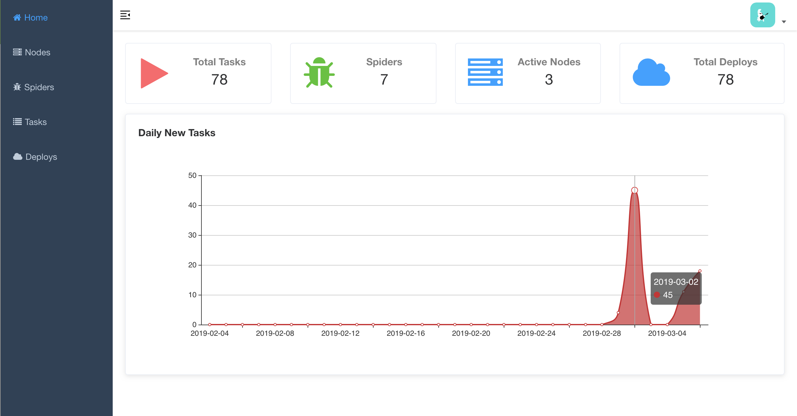
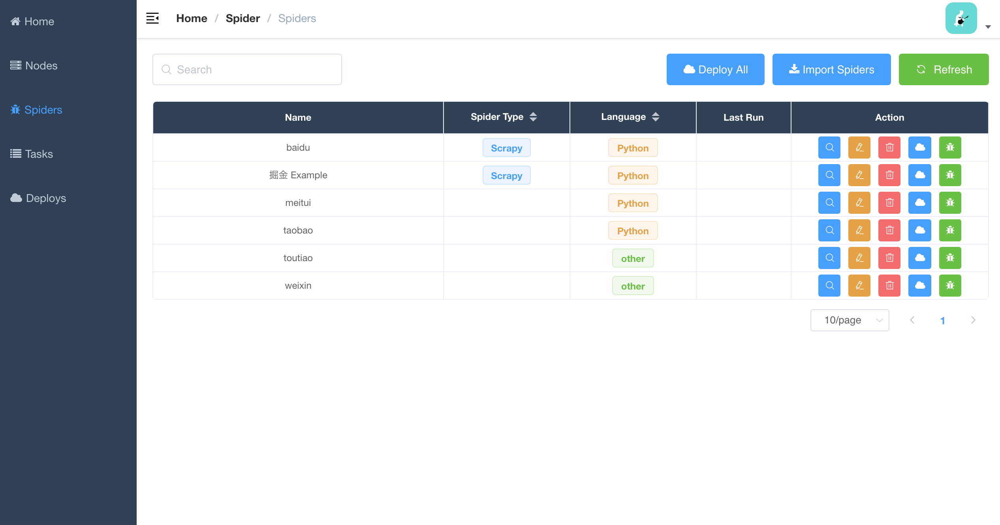
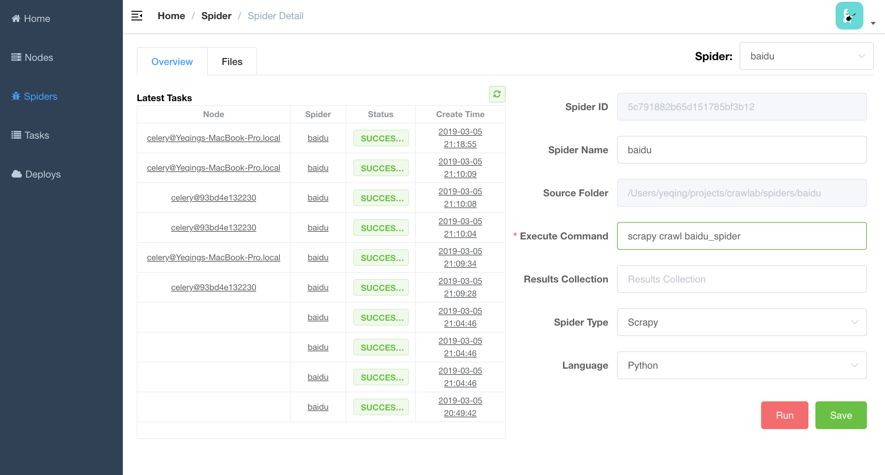
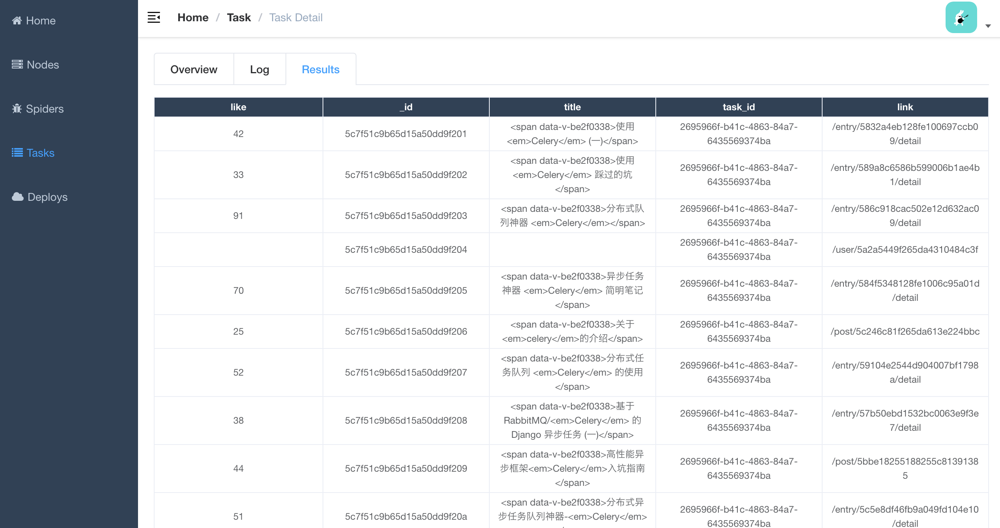

# Crawlab

Celery-based web crawler admin platform for managing distributed web spiders regardless of languages and frameworks. 

[Demo](http://139.129.230.98:8080)

[中文文档](https://github.com/tikazyq/crawlab/blob/master/README-zh.md)

## Pre-requisite
- Python3
- MongoDB
- Redis

## Installation

```bash
# install the requirements for backend
pip install -r requirements.txt
```

```bash
# install frontend node modules
cd frontend
npm install
```

## Configure

Please edit configuration file `config.py` to configure api and database connections.

## Quick Start
```bash
# run all services
python manage.py run_all
```

```bash
# run frontend client
cd frontend
npm run serve
```

## Screenshot

#### Home Page


#### Spider List



#### Spider Detail - Overview



#### Task Detail - Results



## Architecture

Crawlab's architecture is very similar to Celery's, but a few more modules including Frontend, Spiders and Flower are added to feature the crawling management functionality. 


### Nodes

Nodes are actually the workers defined in Celery. A node is running and connected to a task queue, redis for example, to receive and run tasks. As spiders need to be deployed to the nodes, users should specify their ip addresses and ports before the deployment.

### Spiders

##### Auto Discovery
In `config.py` file, edit `PROJECT_SOURCE_FILE_FOLDER` as the directory where the spiders projects are located. The web app will discover spider projects automatically. How simple is that!

##### Deploy Spiders

All spiders need to be deployed to a specific node before crawling. Simply click "Deploy" button on spider detail page and the spiders will be deployed to all active nodes. 

##### Run Spiders

After deploying the spider, you can click "Run" button on spider detail page and select a specific node to start crawling. It will triggers a task for the crawling, where you can see in detail in tasks page.

### Tasks

Tasks are triggered and run by the workers. Users can view the task status, logs and results in the task detail page. 

### App

This is a Flask app that provides necessary API for common operations such as CRUD, spider deployment and task running. Each node has to run the flask app to get spiders deployed on this machine. Simply run `python manage.py app` or `python ./bin/run_app.py` to start the app.

### Broker

Broker is the same as defined in Celery. It is the queue for running async tasks.

### Frontend

Frontend is basically a Vue SPA that inherits from [Vue-Element-Admin](https://github.com/PanJiaChen/vue-element-admin) of [PanJiaChen](https://github.com/PanJiaChen). Thanks for his awesome template.

## Integration with Other Frameworks

A task is triggered via `Popen` in python `subprocess` module. A Task ID is will be defined as a variable `CRAWLAB_TASK_ID` in the shell environment to link the data to the task. 

In your spider program, you should store the `CRAWLAB_TASK_ID` value in the database with key `task_id`. Then Crawlab would know how to link those results to a particular task. For now, Crawlab only supports MongoDB. 

### Scrapy

Below is an example to integrate Crawlab with Scrapy in pipelines. 

```python
import os
from pymongo import MongoClient

MONGO_HOST = '192.168.99.100'
MONGO_PORT = 27017
MONGO_DB = 'crawlab_test'

# scrapy example in the pipeline
class JuejinPipeline(object):
    mongo = MongoClient(host=MONGO_HOST, port=MONGO_PORT)
    db = mongo[MONGO_DB]
    col_name = os.environ.get('CRAWLAB_COLLECTION')
    if not col_name:
        col_name = 'test'
    col = db[col_name]

    def process_item(self, item, spider):
        item['task_id'] = os.environ.get('CRAWLAB_TASK_ID')
        self.col.save(item)
        return item
```

## Comparison with Other Frameworks

There are existing spider management frameworks. So why use Crawlab? 

The reason is that most of the existing platforms are depending on Scrapyd, which limits the choice only within python and scrapy. Surely scrapy is a great web crawl frameowrk, but it cannot do everything. 

Crawlab is easy to use, general enough to adapt spiders in any language and any framework. It has also a beautiful frontend interface for users to manage spiders much more easily. 

|Framework | Type | Distributed | Frontend | Scrapyd-Dependent |
|:---:|:---:|:---:|:---:|:---:|
| [Crawlab](https://github.com/tikazyq/crawlab) | Admin Platform | Y | Y | N
| [Gerapy](https://github.com/Gerapy/Gerapy) | Admin Platform | Y | Y | Y
| [SpiderKeeper](https://github.com/DormyMo/SpiderKeeper) | Admin Platform | Y | Y | Y
| [ScrapydWeb](https://github.com/my8100/scrapydweb) | Admin Platform | Y | Y | Y
| [Scrapyd](https://github.com/scrapy/scrapyd) | Web Service | Y | N | N/A

## TODOs
##### Backend
- [ ] File Management
- [ ] MySQL Database Support
- [ ] Task Restart
- [ ] Node Monitoring
- [ ] More spider examples

##### Frontend
- [ ] Task Stats/Analytics
- [ ] Table Filters
- [x] Multi-Language Support (中文)
- [ ] Login & User Management
- [ ] General Search
